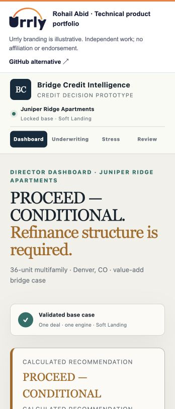

# Bridge Credit Intelligence

Connect deal inputs, underwriting formulas, policy thresholds, downside scenarios and a reviewable recommendation in one stateful workspace.

[Open the live demo](https://urrly.rohailabid.com/projects/bridge/) · [Portfolio overview](https://urrly.rohailabid.com/) · [Local demo pack](urrly-demo-pack.zip)

## Technical focus

TypeScript · React · Policy and stress engines

### Separated decision layers

Calculation, policy, stress, breakpoints and recommendation logic live in distinct modules, so a threshold change is different from a formula change.

### Explainable results

Formula substitutions, source lineage and policy evidence make it possible to inspect how a number or recommendation was produced.

### Consistent workflow state

The demo carries one deal context across the dashboard, underwriting, stress lab and credit review instead of asking the reviewer to rebuild a case on each screen.

## Review path

Change an underwriting assumption, select a downside scenario and compare the result with its formula and policy tests.

## Scope

A synthetic multifamily case demonstrates the workflow. It is not a live loan-origination integration or autonomous credit decision.

Screenshot of the working demo

Independent work by Rohail Abid. Urrly branding is illustrative. Fictional data is used throughout.
