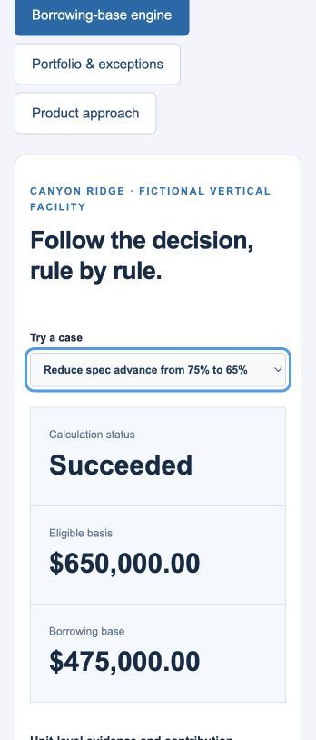

# Collateral Control

Convert agreement terms and collateral records into an explainable calculation, with versioned rules, exact money arithmetic and a reproducible result.

[Open the live demo](https://urrly.rohailabid.com/projects/collateral/) · [Portfolio overview](https://urrly.rohailabid.com/) · [Local demo pack](urrly-demo-pack.zip)

## Technical focus

TypeScript · BigInt · Web Crypto · React

### Versioned configuration

Rules carry evaluation order, agreement citations and effective dates. The engine validates the selected rule version before calculating.

### Exact arithmetic and replay

Amounts use integer cents; rates use basis points. A canonical result fingerprint supports replay checks, while an ordered trace explains each rule’s effect.

### Exceptions as product behavior

The synthetic portfolio includes stable identities and reviewable source exceptions. Missing evidence blocks a result instead of silently substituting zero.

## Review path

Reduce the spec advance rate from 75% to 65%. Then remove a required source and watch the calculation block.

## Scope

This public showcase runs the existing calculation engine and synthetic portfolio locally. Connected intake, account administration, live approvals and release/payoff execution are outside this demo.

## Inspect and run the engine

- [TypeScript calculation engine](collateral-engine.ts)
- [Synthetic reference case](collateral-reference.json)
- [Five runnable checks](engine-checks.mjs)

With Node.js 22.18+ or 24+, download these three files into one directory, then run `node --test engine-checks.mjs`. No dependencies or API keys are required.

Screenshot of the working demo

Independent work by Rohail Abid. Urrly branding is illustrative. Fictional data is used throughout.
