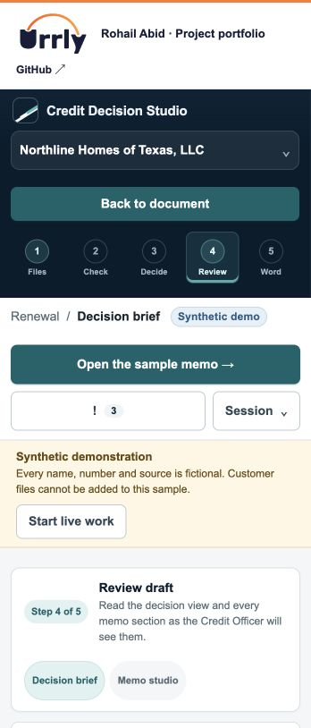

# Credit Decision Studio

Build a credit memo around structured source facts and authored judgment, with a practical document workspace and Word output.

[Open demo](https://urrly.rohailabid.com/projects/credit/) · [Portfolio](https://urrly.rohailabid.com/)

## Credit view

### Prepare the memo

Organize the transaction, source analysis and credit narrative around the document the reviewer needs.

### Keep judgment explicit

Distinguish source facts from authored rationale, mitigants and recommendations.

### Move to review

Use the structured workflow to prepare a reviewable memo and export an editable Word document.

## Technical view

AI-assisted prototype. These notes describe the current implementation.

Browser application · Structured documents · Word export

### Evidence and judgment

Source analysis and authored rationale occupy distinct parts of the workflow so a draft does not disguise assumptions as verified evidence.

### Deliverable-oriented design

The application is organized around preparing and reviewing the memo, including document structure, review controls and export.

### Local document processing

The document workflow runs in the browser and preserves local handling of its source files and generated documents.

## Try it

Choose the synthetic demo, open Sources & analysis, then inspect the memo and its Word export.

## Demo scope

This is a local synthetic document workflow. It is not represented as a deployed bank system or an independently verified AI underwriting service.

Screenshot

