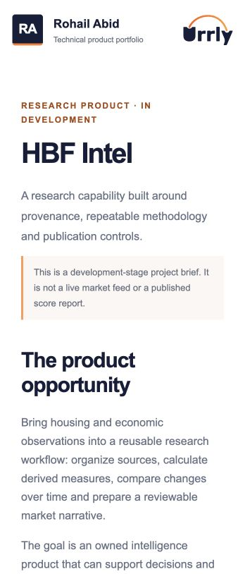

# HBF Intel

A homebuilding intelligence product designed around source provenance, repeatable methodology, historical validation and controlled publication.

[Open the live demo](https://urrly.rohailabid.com/projects/intel/) · [Portfolio overview](https://urrly.rohailabid.com/) · [Local demo pack](urrly-demo-pack.zip)

## Technical focus

Data modeling · Research methodology · Publication controls

### A reusable research capability

The aim is a maintainable source-to-publication workflow that supports recurring internal analysis and original external research.

### Provenance and methodology

Source and period metadata distinguish observations from derived measures; scoring and validation work make assumptions inspectable.

### An honest development boundary

The portfolio includes a brief. Live feeds, published market scores and live AI narratives are not presented as verified working features.

## Review path

Read the brief to see how source observations, derived measures and publication decisions fit together.

## Scope

Development-stage project brief, not an interactive live-data product.

Screenshot of the working demo

Independent work by Rohail Abid. Urrly branding is illustrative. Fictional data is used throughout.
