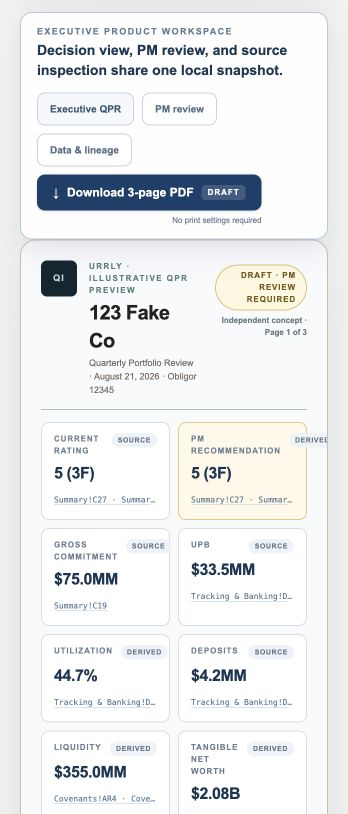

# QPR Intelligence

Turn an Excel package into typed relationship records, reconciled metrics, source-linked findings and a reviewable PDF—all in the browser.

[Open demo](https://urrly.rohailabid.com/projects/qpr/) · [Portfolio](https://urrly.rohailabid.com/)

## Credit view

### Recurring reviews

Turn a structured monitor into a consistent quarterly review, with key changes and risk indicators assembled in one place.

### Evidence behind the conclusion

Inspect the workbook source behind a metric and distinguish verified financial facts from the portfolio manager’s interpretation.

### Committee preparation

Produce a three-page PDF review while keeping rationale, mitigants and final conclusions subject to human review.

## Technical view

AI-assisted prototype. These notes describe the current implementation.

TypeScript · OOXML · React · PDF rendering

### Controlled ingestion

The parser selects required workbook parts, enforces size limits and normalizes dates, periods and cells into a structured relationship record.

### Traceable transformations

Calculations and reconciliation are separate from the interface. Metric lineage retains the sheet and cell evidence used to construct the result.

### Governed output

The same normalized record feeds the review interface and PDF. Deterministic narrative templates keep computed facts separate from portfolio-manager judgment.

## Try it

Open the demo relationship, inspect the source behind a metric, then generate the three-page review PDF.

## Demo scope

Quarterly reviews and PDF output work in this demo. Annual reviews, Word memos and PowerPoint decks are possible adaptations, not current QPR outputs.

Screenshot

