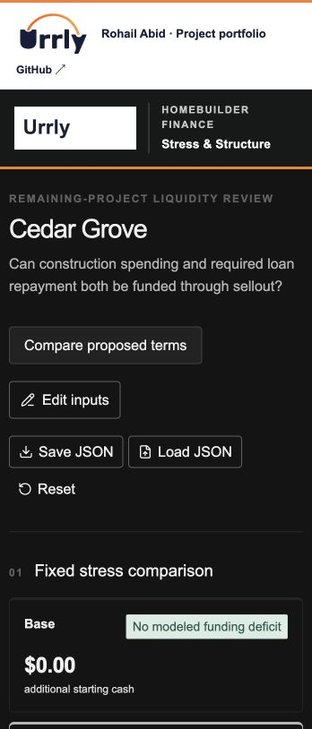

# Loan Structure Lab

Model construction spending, inventory, closings, loan balances and repayment month by month, then compare terms and stress cases.

[Open demo](https://urrly.rohailabid.com/projects/structure/) · [Portfolio](https://urrly.rohailabid.com/)

## Credit view

### Find the funding gap

See when construction spending and required repayments create a cash shortfall through sellout.

### Compare proposed terms

Evaluate how repayment sweeps, timing and other terms change liquidity and the path to repayment.

### Review the detail

Follow monthly cash flows behind the summary results and carry the analysis into CSV or Word exhibits.

## Technical view

AI-assisted prototype. These notes describe the current implementation.

TypeScript · Zod · Monthly ledger · DOCX/CSV

### Model before presentation

Typed scenario inputs feed a separate domain calculation layer; the interface presents the resulting funding, cash-flow and repayment outputs.

### Validated scenario changes

Input validation and structured scenario files make assumptions explicit. The monthly ledger exposes timing effects hidden by summary ratios.

### Reusable outputs

CSV and Word exports use the scenario results, connecting analysis to a work product rather than leaving the result trapped on a dashboard.

## Try it

Compare Base and Downside, change a repayment sweep, and inspect the month-by-month cash and funding effects.

## Demo scope

A local scenario model with fictional project data. It does not execute transactions or synchronize with a live servicing platform.

Screenshot

